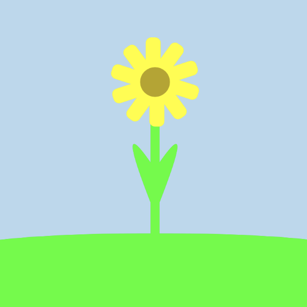
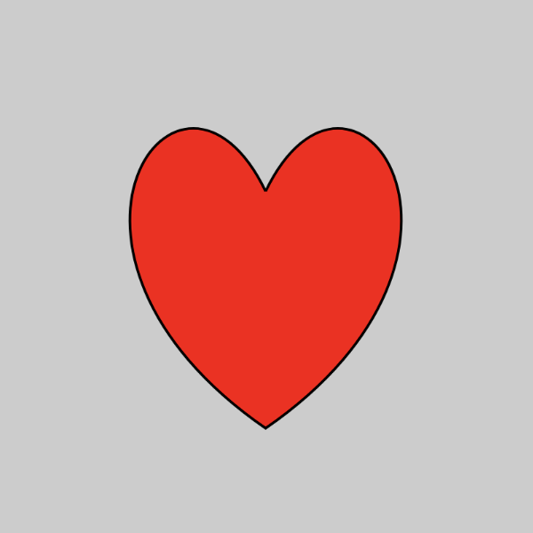
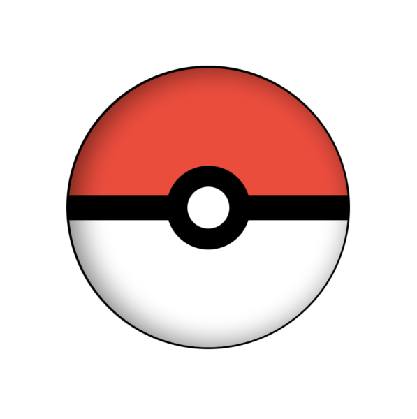

# Drawing with Different Languages

Welcome to **Drawing with Different Languages**! This repository showcases a collection of creative drawings made with various programming frameworks such as **Compose**, **SwiftUI**, and more. Examples include drawings of a **flower**, a **heart**, a **Pokeball**, and many others. These visual representations are built using modern UI libraries to demonstrate the artistic side of coding.

## 📦 Technologies Used

- **Jetpack Compose** (for Android)
- **SwiftUI** (for iOS)
- Other UI frameworks and technologies

## ✨ Examples of Drawings

Here are a few examples of what you'll find in this repo:

### 🌸 Flower

This drawing demonstrates how to create a simple flower using **Jetpack Compose**.

### ❤️ Heart

A beautiful heart shape created with **SwiftUI**.

### 🔴 Pokeball

This is a fun and iconic drawing of a **Pokeball**, made with **Flutter**.

